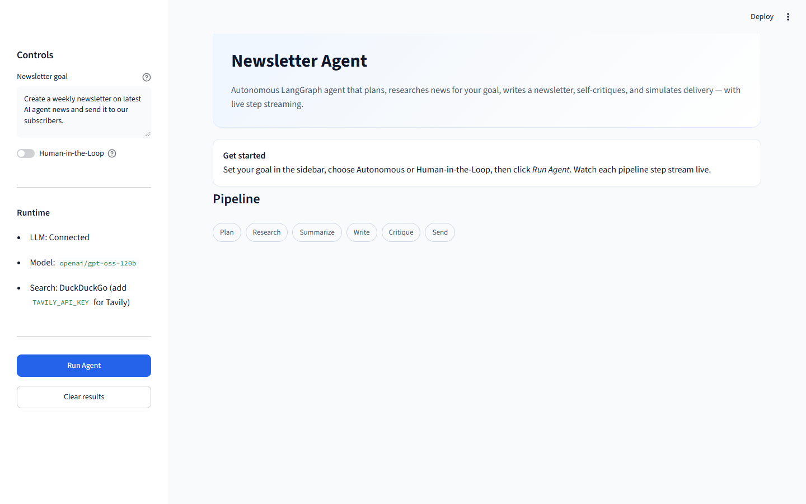
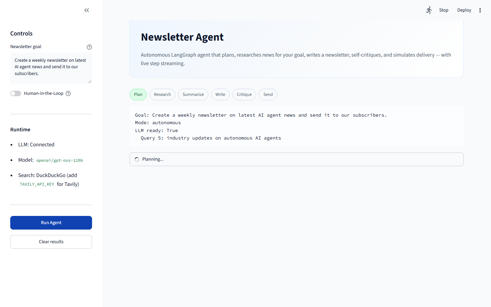
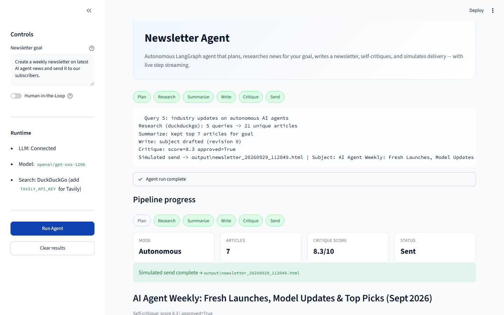
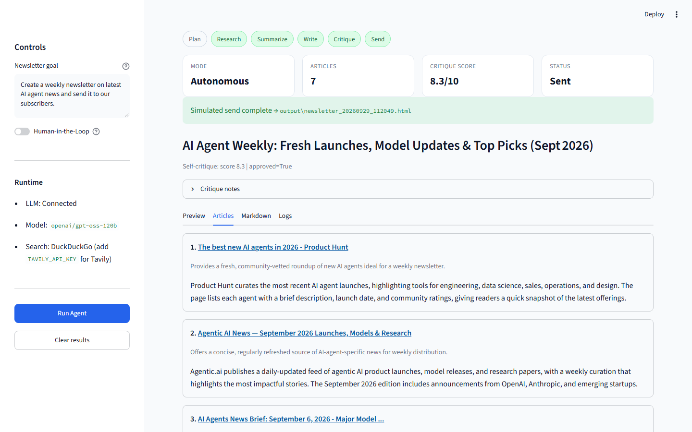
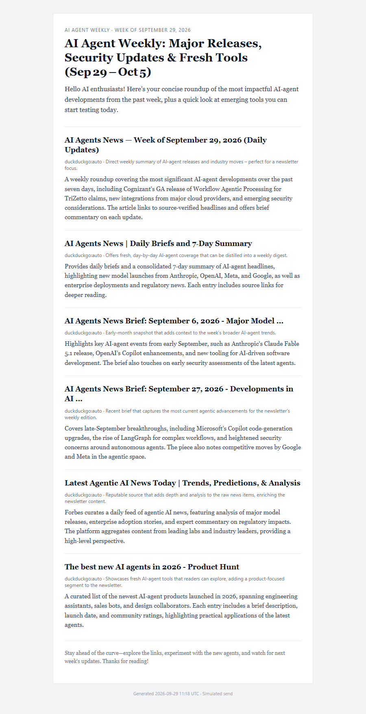

# Newsletter Agent

Mini autonomous agent that researches news for **any plain-English goal**, drafts a weekly newsletter, self-critiques, and simulates sending it (saves HTML + subject).

Built with **LangGraph**, **Groq**, **Tavily / DuckDuckGo** search, and **Streamlit**.

## Screenshots

### Home UI


### Live step streaming
Pipeline chips and status update as each LangGraph node finishes.


### Completed run
Metrics, critique score, and simulated send path.


### Selected articles


### HTML newsletter output


## Pipeline

```
goal -> plan -> research -> summarize -> write -> critique <-> write
                                              |
                                    HITL? -> human approve/revise
                                              |
                                         simulate send (HTML file)
```

Live streaming: `stream_newsletter_agent(goal, mode)` yields each step as it runs.
Blocking entrypoint: `run_newsletter_agent(goal, mode="autonomous"|"hitl")`.

## Setup

```bash
python -m venv .venv
.venv\Scripts\activate          # Windows
# source .venv/bin/activate     # macOS/Linux

pip install -r requirements.txt
copy .env.example .env
```

### Environment

| Variable | Required | Notes |
|----------|----------|-------|
| `GROQ_API_KEY` | Yes | [console.groq.com](https://console.groq.com/) |
| `GROQ_MODEL` | No | Default `openai/gpt-oss-120b` |
| `TAVILY_API_KEY` | Recommended | [tavily.com](https://tavily.com) — preferred search. Falls back to DuckDuckGo if unset |

`.env` is gitignored — never commit keys.

## Run (localhost)

```bash
streamlit run app.py --server.port 8503
```

Open **http://localhost:8503**

Watch Plan → Research → Summarize → Write → Critique → Send stream live in the UI.

Or from Python:

```python
from newsletter_agent import run_newsletter_agent, stream_newsletter_agent

# Blocking
result = run_newsletter_agent(
    "Create a weekly newsletter on latest sports news and send it to our subscribers."
)
print(result.subject, result.output_path)

# Live steps
for event in stream_newsletter_agent("Create a weekly AI agents newsletter"):
    print(event.label, "-", event.message)
    if event.done:
        print(event.result.subject)
```

### Recapture screenshots

```bash
# App must be running on :8503
python scripts/capture_screenshots.py
```

## Layout

```
app.py
scripts/capture_screenshots.py
docs/screenshots/
newsletter_agent/
  config.py
  llm.py
  goal_utils.py
  graph.py           # stream + run + resume
  state.py
  nodes/
  tools/
    search.py        # Tavily preferred, DuckDuckGo fallback
    html_builder.py
  templates/
output/
```

## Demo video

Record a short Loom/screen capture covering:
1. Goal input (try sports + AI to show topic following)
2. Live pipeline streaming
3. Preview / articles / download HTML
4. Optional HITL approve flow

## License

MIT
